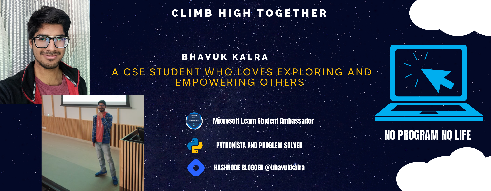

<h1 align="center">Hi 👋, I'm Bhavuk Kalra</h1>
<h3 align="center">Researcher and Chess lover</h3>

- 🔭 I’m currently working on [Min-Max-TicTacToe](https://github.com/bhavukkalra/TicTacToe_Min_Max)

- 🌱 I’m currently learning **ReactJS, Azure**

- 👨‍💻 All of my projects are available at [https://bhavukkalra.github.io/my-website/](https://bhavukkalra.github.io/my-website/)

- 📝 I regularly write articles on [https://bhavukkalra.hashnode.dev/](https://bhavukkalra.hashnode.dev/)

- 💬 Ask me about **MERN, Reinforcement Learning**

- 📫 How to reach me **bhavukkalra1786@gmail.com**

### Blogs posts
<!-- BLOG-POST-LIST:START -->
<!-- BLOG-POST-LIST:END -->

<h3 align="left">Connect with me:</h3>

<h3 align="left">Languages and Tools:</h3>

                  

<h3 align="left">Support:</h3>

  

&nbsp;

